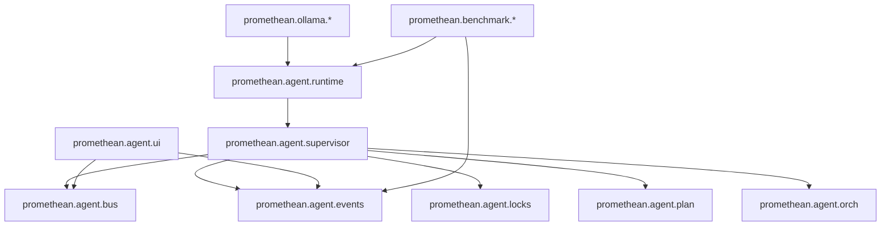
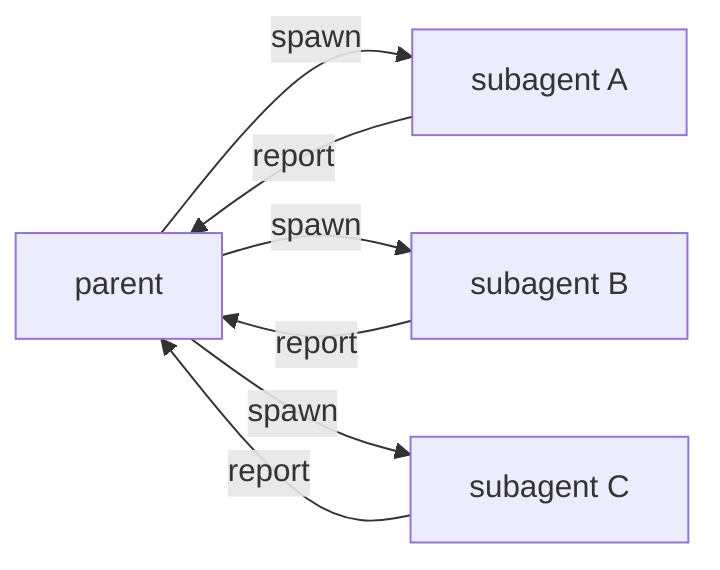

Alright, let’s push this into a **real framework shape**.

What you’re describing is basically:

> a **supervisor tree** that coordinates a swarm of constrained workers, with durable event logs, file-locking, and resumable execution — and the *same* core runtime powers both production agents and benchmark harnesses.

If we design it right, the whole thing becomes a **highly concurrent hierarchical problem-solving machine** that you can *inspect*, *edit*, and *resume*.

---

## The “Agent OS” mental model

### Two planes

* **Control plane** (coordination)

  * agent lifecycle
  * messaging
  * file locks
  * budgets
  * scheduling
* **Work plane** (doing)

  * LLM calls
  * tool invocations
  * container runs
  * tests / builds

In Clojure terms:

* **control plane**: `core.async` channels + state machines
* **work plane**: thread pools (or virtual threads) for IO-heavy work

---

## A concrete module layout

This is the “you can actually build it” tree:



### What each does

* `agent.runtime` — spawn/run agent loops, common machinery
* `agent.supervisor` — parent agents coordinating children
* `agent.bus` — messaging topology rules + routes
* `agent.events` — JSONL event writer + reducer (rebuild state)
* `agent.locks` — file/resource lock service + conflict threads
* `agent.plan` — plan file format + reconciliation engine
* `agent.orch` — container runner + tool runner + test runner
* `agent.ui` — HTTP + WS to tail logs and show live state
* `ollama.*` — model provider + tools (already started)
* `benchmark.*` — suites, runners, scoring, reports

---

## The core data model (minimal but sufficient)

### Agent spec (what parent *decides*)

```clojure
{:agent/id "agent-1.2"
 :agent/parent "agent-1"
 :agent/depth 2

 :agent/model {:name "qwen3:14b"
               :provider :ollama}

 :agent/instructions "You are a focused worker..."
 :agent/toolset [:fs/read :fs/write :sh/run]  ;; tool ids
 :agent/budget {:max-steps 8
                :max-tool-calls 40
                :max-ms 180000
                :max-model-calls 8}

 :agent/topology {:can-talk-to #{:parent :children}
                  :can-signal #{:parent}}}
```

### Agent runtime state (derived from events)

```clojure
{:state/status :running|:sleeping|:blocked|:done|:failed
 :state/step 3
 :state/locks #{"frontend/src/App.tsx"}
 :state/current-task "Implement message list"
 :state/children #{"agent-1.2.1" "agent-1.2.2"}}
```

### Message (ephemeral but evented)

```clojure
{:msg/id "m-123"
 :msg/from "agent-1.2"
 :msg/to "agent-1"
 :msg/type :chat|:state|:request|:conflict
 :msg/body "...string or EDN..."
 :msg/ts 1730000000000}
```

---

## Event sourcing: the secret to “never lose progress”

Everything becomes events appended to JSONL:

* if you crash, you replay
* if you want UI, you tail
* if you want resume, you reconcile

### Events you actually need (MVP)

```clojure
:agent/spawned
:agent/status
:agent/message
:tool/requested
:tool/result
:lock/acquired
:lock/released
:plan/loaded
:plan/updated
:task/state
:bench/case-start
:bench/case-end
```

Your entire runtime state is the reduction of those events.

---

## The concurrency pattern (supervisor tree)

The parent’s job is not “do work”, it’s:

* break down
* dispatch
* wait
* merge
* resolve conflicts
* escalate if needed

### Parent sleep/wake logic

A parent agent is *mostly asleep*.

It wakes when something changes:

* child message
* child done/fail
* lock conflict
* time tick (to avoid dead silence)
* plan updated by human

That is literally `alts!` over several channels.

---

## Supervisor loop skeleton (core.async)

This is the **entire runtime vibe** in one snippet:

```clojure
(ns promethean.agent.supervisor
  (:require [clojure.core.async :as a]
            [promethean.agent.events :as evt]
            [promethean.agent.bus :as bus]))

(defn supervisor-loop!
  [{:keys [agent inbox tick child-events plan-events stop-ch]}]
  (a/go-loop [state {:status :sleeping
                     :children #{}
                     :pending []}]
    (let [[v ch] (a/alts! [inbox tick child-events plan-events stop-ch]
                          :priority true)]
      (cond
        (= ch stop-ch)
        (do (evt/emit! {:type :agent/status :agent (:agent/id agent) :status :stopped})
            state)

        (= ch tick)
        (do
          (evt/emit! {:type :agent/status :agent (:agent/id agent) :status :woke :reason :tick})
          ;; check children, schedule more work if needed
          (recur state))

        (= ch plan-events)
        (do
          (evt/emit! {:type :plan/updated :agent (:agent/id agent) :delta v})
          ;; reconcile plan changes (spawn/cancel children)
          (recur state))

        (= ch child-events)
        (do
          (evt/emit! {:type :agent/message :agent (:agent/id agent) :from (:from v) :body v})
          ;; update state from child progress, maybe wake and act
          (recur state))

        (= ch inbox)
        (do
          (evt/emit! {:type :agent/message :agent (:agent/id agent) :from (:from v) :body v})
          ;; messages from parent/human
          (recur state))

        :else
        (recur state)))))
```

The “powerful top agent” is just this loop with a stronger model + broader tools.

---

## Spawning async subagents (fan-out/fan-in)

The parent uses the *work plane* to start N children concurrently:

* each child has its own inbox channel
* each child reports into the parent’s `child-events` channel
* parent never blocks on a single child

The shape you want is:



---

## Tool calls as “jobs” (not just function calls)

This matters a lot for concurrency + durability.

A tool call should be:

1. recorded (`:tool/requested`)
2. executed async
3. recorded (`:tool/result`)
4. only then fed back into the agent

So the tool runner can be a generic work queue.

### Why that’s important

* you can retry tools deterministically
* you can stream results to disk
* you can resume “mid-flight” with an idempotency key
* you can limit concurrency per tool type (`docker` vs `fs` vs `llm`)

---

## File/resource locking (the “who owns this file?” system)

Treat file locks as a dedicated service:

* `acquire!` returns `:ok` or `:blocked {:owner ...}`
* locks have TTL + heartbeats
* on conflict: create a **conflict thread**

### Conflict thread = a structured backchannel

When agent hits a locked file:

1. emit `:lock/blocked`
2. open conflict thread with participants:

   * lock owner
   * requester
   * parent supervisor (arbiter)

This thread is still “ephemeral”, but stateful enough to resolve quickly.

---

## “Conversation graph” routing rules (sane defaults)

By default:

* child → parent ✅
* parent → child ✅
* child → sibling ❌ (unless parent routes)

This is huge because it prevents swarms from becoming a chatroom.

But you *do* want configurability:

```clojure
{:agent/topology
 {:can-talk-to #{:parent :children}
  :allow-peer? false
  :peer-via-parent? true}}
```

So siblings can “talk”, but only through the parent arbitrator.

---

## The plan-as-artifact idea (this is your best UI surface)

You nailed it:

> you don’t want to *write* these constantly
> but you want the machine to output them in a form you can edit and re-evaluate

So the plan should be:

* EDN
* resumable
* reconciled continuously

### Plan file example

```clojure
{:goal "create and integrate a full stack web chat"
 :tasks
 [{:id "frontend"
   :goal "create a frontend websocket chat app"
   :cwd "frontend"
   :acceptance
   [{:sh ["npm" "test"]}
    {:sh ["npm" "run" "typecheck"]}
    {:require-file "README.md"}]}

  {:id "backend"
   :goal "create a clojure websocket backend chat"
   :cwd "backend"
   :acceptance
   [{:sh ["clj" "-M:test"]}
    {:http {:method :get :url "http://localhost:3000/healthz"}}]}]}
```

The parent agent can generate this, and you can edit it.

Then the runtime runs a **reconciler**:

* if task added → spawn
* if removed → cancel
* if changed → restart / reassign

That becomes your “human steering wheel”.

---

## Agentic evaluation benchmark (coding agent)

You want benchmark tasks like:

* echo server
* chat app
* simple game
* login page

The key is: don’t overconstrain.

### The trick: test observable behavior, not structure

* UI: Playwright + roles + text semantics
* API: contract endpoints + flexible JSON partial matches
* Websocket: integration tests (connect/send/receive)

This gives “human-realistic prompts” without brittle specs.

---

## Reports + resumability + UI server

### The “run folder” contract

Every suite outputs to:

```
reports/<suite>/<run-id>/
  events.jsonl
  summary.json
  artifacts/
```

The runner should **append events continuously**.

The UI server should:

* tail `events.jsonl`
* rebuild state in memory
* show agent tree, locks, tool calls, and case results live

### Minimal UI endpoints

* `GET /runs` → list runs
* `GET /run/:id/state` → reduced state snapshot
* `WS /run/:id/events` → event stream

---

## Container orchestration DSL (keep it small but expressive)

Start with “container as tool”:

```clojure
{:tool :docker/run
 :image "node:20"
 :mounts [{:host "." :container "/work"}]
 :workdir "/work"
 :cmd ["bash" "-lc" "npm test"]
 :env {"CI" "1"}}
```

Later, if you want compose-like graphs:

```clojure
{:stack
 [{:name "redis" :image "redis:7" :ports [{:host 6379 :container 6379}]}
  {:name "sut" :image "node:20" :depends-on ["redis"] ...}]}
```

But MVP can just shell out `docker run` + capture logs.

---

## The “hierarchical agent mode” you want (in one sentence)

A parent agent is a **scheduler + judge + mediator**.

Children are **specialists** with restricted tools/models.

Depth increases → capability decreases → determinism increases.

That’s how you get:

* strong planning + synthesis at the top
* cheap parallel exploration below
* tight, deterministic implementation at the leaves

---

## The next concrete build step

If you want to keep momentum, the next “real” thing to implement is:

### `promethean.agent.events`

* `emit!` appends JSONL
* `reduce-events` rebuilds `world-state`

Once you have that, everything else becomes easier because you can *see* the system.

If you want, I’ll sketch the reducers + state reconstruction next (and how to wire it so the supervisor tree + benchmark runner both write into the same event stream).
